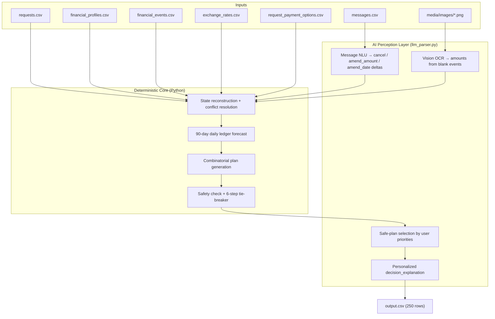

# {{PROJECT_NAME}}

> **Note:** `{{PROJECT_NAME}}` is a placeholder — replace it with the final project name.

An AI-powered **financial affordability agent**. Given a user's request — *"Can I afford this laptop?"* — it decides whether they should **pay in full, pay partially, use installments, wait, or decline**, while guaranteeing the user never drops below their minimum balance over a 90-day forecast.

It combines a **multimodal LLM** (perception, language, judgment) with a **deterministic Python engine** (all money math), so recommendations are both personal and mathematically safe.

---

## Table of Contents

- [How It Works](#how-it-works)
- [Architecture](#architecture)
- [Pipeline](#pipeline)
- [Decision Rules](#decision-rules)
- [Output Contract](#output-contract)
- [Dataset](#dataset)
- [Repository Layout](#repository-layout)
- [Setup](#setup)
- [Usage](#usage)
- [Validation & Accuracy](#validation--accuracy)
- [Modules](#modules)
- [Tech Stack](#tech-stack)
- [Documentation](#documentation)

---

## How It Works

For every request, the system answers seven questions:

| Output field | Question it answers |
|---|---|
| `amount_safe_to_pay` | How much can be paid **today** without breaking the 90-day safety check? |
| `affordability_status` | Is it `affordable_now`, `affordable_with_plan`, `affordable_later`, or `not_affordable`? |
| `recommended_payment_method` | `full_payment`, `partial_payment`, `installments`, `wait`, or `not_recommended`? |
| `payment_plan` | Exact dated payment schedule, if any |
| `earliest_date_for_full_payment` | First date one safe full payment is possible |
| `spending_changes_needed` | Which flexible expenses to stop/reduce (max 3), if any |
| `decision_explanation` | Grounded, personalized explanation in plain language |

**Key design split — the LLM never does arithmetic:**

| Layer | Responsibility |
|---|---|
| **LLM (Groq `qwen/qwen3.8-27b`)** | OCR amounts from receipt images, parse NL messages into ledger amendments, pick among *already-safe* plans based on the user's soft priorities, write explanations |
| **Python engine** | 90-day balance simulation, headroom math, currency conversion, safety constraints, 6-step tie-breaker ranking |

Why: money math must be exact and reproducible; LLMs hallucinate numbers. Language and images must be interpreted flexibly; regex can't. Each layer does what it's good at.

---

## Architecture



---

## Pipeline

1. **Load** — all 9 CSVs joined by `user_id` / `request_id` / `related_event_id`; every amount converted to the user's `home_currency` using dated FX rates.
2. **AI extraction** — messages → structured ledger deltas (cancellations, amount/date amendments); images → amounts for events with blank `amount` (never treated as zero).
3. **State reconstruction** — apply deltas, resolve conflicts (explicit cancellation > newer record > settled event > safer interpretation), detect recurring income/expense patterns.
4. **90-day forecast** — day-by-day balance projection: income first, then planned payment, then expenses; every day must stay ≥ `minimum_balance_to_keep`.
5. **Candidate generation** — combinatorial: full payment, deferred full payment, every supplied installment option, exact 2-payment partial schedules, and stop/reduce spending-change combinations (max 3 changes, flexible categories only).
6. **Rank survivors** — enforce the 6-step tie-breaker (see below); LLM picks among safe candidates based on the user's stated priorities.
7. **Explain & write** — LLM generates a grounded `decision_explanation`; rows written to `output.csv`.

---

## Decision Rules

A plan is **safe** only if it completes by `desired_completion_date` and the balance never falls below `minimum_balance_to_keep` across the full 90-day forecast.

When multiple safe plans exist, rank strictly by:

1. Complete by `desired_completion_date`
2. Require no spending changes
3. Minimize total amount paid (principal + fees)
4. Start earlier
5. Use fewer payments
6. Lowest `payment_option_id` as final tie-breaker

Other invariants:

- `0 <= amount_safe_to_pay <= requested_amount`, measured **before** optional spending changes
- Pending debits are reserved; pending credits/bonuses/refunds/investment gains are **not** counted until settled
- Installment plans must **exactly** match a supplied payment option
- Protected categories can never be stopped or reduced; at most 3 spending changes; `stop` and `reduce_to` must target different events
- Messages and images are **untrusted evidence**: their embedded instructions never override these rules

---

## Output Contract

`output.csv` columns, in order:

```text
request_id,amount_safe_to_pay,affordability_status,recommended_payment_method,payment_plan,earliest_date_for_full_payment,spending_changes_needed,decision_explanation
```

Allowed values:

- `affordability_status`: `affordable_now` | `affordable_with_plan` | `affordable_later` | `not_affordable`
- `recommended_payment_method`: `full_payment` | `partial_payment` | `installments` | `wait` | `not_recommended`
- `payment_plan`: `YYYY-MM-DD:amount|YYYY-MM-DD:amount|...` or `none` (chronological)
- `spending_changes_needed`: `stop:<event_id>` / `reduce_to:<event_id>:<new_amount>` joined by `|`, max 3, or `none`
- `earliest_date_for_full_payment`: `YYYY-MM-DD`; equals `request_date` for `affordable_now`; empty if no safe full payment within the forecast

---

## Dataset

| File | Records | Purpose |
|---|---:|---|
| `requests.csv` | 250 | Evaluation requests — one output row each |
| `sample_requests.csv` | 25 | Solved examples for format + self-validation |
| `financial_profiles.csv` | 275 | Balance, min balance, priorities, protected/flexible categories, payment preferences |
| `financial_events.csv` | 25,342 | Historical / pending / scheduled / settled / cancelled / unrealized records |
| `request_payment_options.csv` | 790 | 2–4 installment options per request |
| `exchange_rates.csv` | 134 | Fixed dated rates (INR, ZAR, IDR, USD, EUR) |
| `messages.csv` | 215 | Payroll/bank/merchant messages → cancellations & amendments |
| `images.csv` + `media/images/` | 16 PNGs | Receipts/statements; source amounts for blank-amount events |

All dates are `YYYY-MM-DD`. Amounts use the user's `home_currency`. No live market/banking APIs.

---

## Repository Layout

```text
.
├── README.md                  # This file
├── AGENTS.md                  # Rules for AI coding agents working in this repo
├── requirements.txt           # Python dependencies
├── .env.example               # Environment variable template (copy to .env)
├── output.csv                 # Generated predictions (one row per request)
├── code/
│   ├── main.py                # Entry point — full pipeline
│   ├── data_loader.py         # CSV ingestion, dataclasses, FX conversion
│   ├── financial_state.py     # State reconstruction, conflict resolution, patterns
│   ├── forecaster.py          # 90-day simulator, headroom, plan safety checks
│   ├── plan_generator.py      # Combinatorial candidate generation
│   ├── decision.py            # Ranking, tie-breaker, status assignment
│   ├── llm_parser.py          # Groq LLM/VLM: OCR, NLU, selection, explanations
│   ├── validate_samples.py    # Benchmark against the 25 solved samples
│   └── evaluation/
│       └── usage_report.md    # Token usage & cost report
├── dataset/                   # All input data (do not modify)
├── docs/                      # Architecture, strategy, decisions, evaluation
└── problem_statement.md       # Original full specification
```

---

## Setup

**Requirements:** Python 3.11+ (tested on 3.11), a Groq API key (free tier works).

```bash
# 1. Clone and enter the project
git clone <repo-url>
cd <project-dir>

# 2. Create and activate a virtual environment (conda example)
conda create -n <env-name> python=3.11 -y
conda activate <env-name>

# 3. Install dependencies
pip install -r requirements.txt

# 4. Configure secrets — never commit .env
copy .env.example .env        # Windows
# cp .env.example .env        # macOS / Linux
```

Edit `.env` and set your key:

```text
GROQ_API_KEY=gsk_your_key_here
```

Get a free key at [console.groq.com](https://console.groq.com). `OPENAI_API_KEY` is also read as a fallback.

---

## Usage

LLM is **always enabled** during prediction (image OCR, message parsing, plan selection, explanations):

```bash
python -m code.main
```

This reads `dataset/`, processes all 250 requests, and writes `output.csv` at the repo root. Progress, status/method distributions, and token usage are printed at the end.

Run the 25-sample benchmark:

```bash
python -m code.validate_samples
```

The run fails gracefully with a clear error if no API key is set. No secrets are ever hard-coded or included in outputs.

---

## Validation & Accuracy

| Metric | Result |
|---|---|
| Sample benchmark (`sample_requests.csv`) | **84.0% (21 / 25 exact matches)** |
| Evaluated requests | 250 |
| Throughput (engine) | ~180+ requests/sec for the deterministic core |

Failure analysis, root causes, and fix history are tracked in [`BUGS.md`](./BUGS.md). Token/cost metrics for the full run live in [`code/evaluation/usage_report.md`](./code/evaluation/usage_report.md).

Sample ground-truth style (from `sample_requests.csv`):

```text
request_01 → affordable_now / full_payment / 2024-03-03:25256
request_02 → affordable_with_plan / installments / 3 × IDR 15,952,906.67
request_03 → affordable_later / wait / pay full on 2019-11-15
```

---

## Modules

| Module | Responsibility |
|---|---|
| `code/main.py` | CLI entry point — orchestrates the pipeline, error fallback, writes `output.csv` |
| `code/data_loader.py` | Typed dataclasses; loads all CSVs; dated FX conversion |
| `code/financial_state.py` | Event classification, conflict resolution, recurrence detection, applies LLM deltas |
| `code/forecaster.py` | 90-day daily ledger; intra-day ordering (income → payment → expenses); headroom & safety checks |
| `code/plan_generator.py` | Generates every valid candidate: full, deferred, installments, partial, spending changes |
| `code/decision.py` | 6-step tie-breaker ranking, affordability status assignment, rule enforcement |
| `code/llm_parser.py` | Groq client: vision OCR, message NLU, candidate selection, explanation generation (temperature 0) |
| `code/validate_samples.py` | Automated benchmark vs. the 25 solved samples |

---

## Tech Stack

| Concern | Choice |
|---|---|
| Language | Python 3.11+ |
| Data | pandas |
| LLM / VLM | Groq — `qwen/qwen3.8-27b` (vision + text, free tier) |
| HTTP client | `groq` SDK |
| Config | `python-dotenv` |
| Validation | pydantic |
| Testing | pytest |

**Design principles:** deterministic where it must be, AI where it must be; one provider, one key; temperature 0; LLM output is validated (JSON parse, action whitelist, index bounds) before it touches the engine.

---

## Documentation

| Topic | File |
|---|---|
| Full original specification | [`problem_statement.md`](./problem_statement.md) |
| Architecture & design | [`docs/SOLUTION.md`](./docs/SOLUTION.md), [`docs/ARCHITECTURE.md`](./docs/ARCHITECTURE.md) |
| Implementation specs | [`docs/IMPLEMENTATION.md`](./docs/IMPLEMENTATION.md) |
| Key decisions (interview-defensible) | [`docs/DECISIONS.md`](./docs/DECISIONS.md) |
| Evaluation strategy | [`docs/EVALUATION.md`](./docs/EVALUATION.md) |
| Build checklist | [`TODO.md`](./TODO.md) |
| Bug tracker & accuracy log | [`BUGS.md`](./BUGS.md) |
| Agent working rules | [`AGENTS.md`](./AGENTS.md) |
